# Tipografia de um projeto em React

## 1. Instale os pacotes necessários e rode o projeto

`npm install`  
`npm start`

## 2. Objetivo deste modelo de tipografia

Ter um conjunto de componentes estilizados, com propriedades padrões, e que tenham flexibilidade para serem alterados visualmente e semanticamente.

Exemplo de uso:  
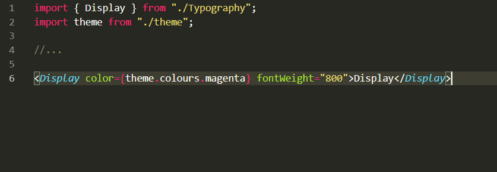

Ou a invés de usar as cores pré-definida dos temas, também poder utilizar uma cor padrão do HTML:
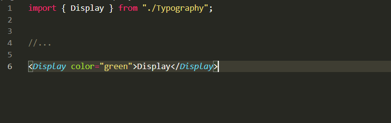

## 3. O modelo utilizado

Este modelo foi utilizado tendo como base 2 principais pacotes: styled-components e styled-system. 
Styled Componentes permite colocar estilos diretamente no componente, e o styled system permite flexibilizar a forma de passar props para os componentes, permitindo a criação de componentes dinâmicos, ao mesmo tempo que mantém o código enxuto.

No arquivo theme.js, colocamos todas as definições padrões dos nossos componentes, com os valores default para cada um deles.

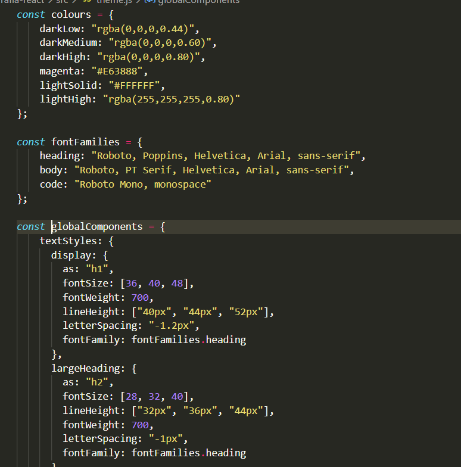

### 3.1 Multiplas fontes
Este modelo de multiplas fontes presente na variável fontFamilies segue uma prioridade de uso. A primeira fonte é a fonte que possui a prioridade de uso. Caso o browser não tenha suporte para a primeira fonte, ele utiliza a segunda fonte, se não tiver novamente, usa a próxima.

### 3.2 Breakpoints

Algumas propriedades, recebem um array de valores. Esse array é relacionado a responsividade do componente de acordo com o tamanho de cada tela. Isto é configurado pelo array breakpoints que define a largura mínima de cada tela.

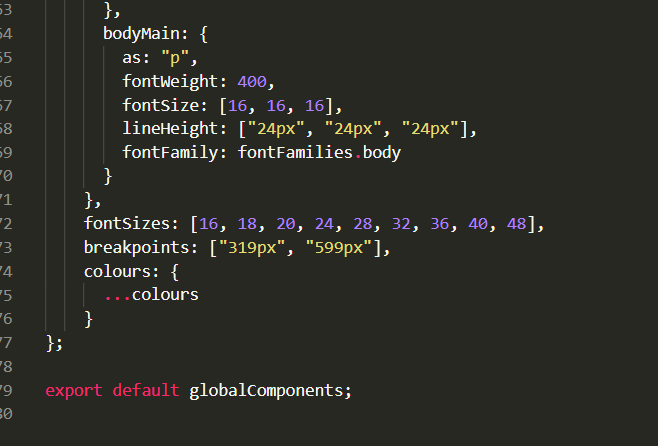

Por exemplo, a propriedade "fontSize: [36, 40, 48]", é 36px para telas que se enquadrem no breakpoint A (min-width = 319px). 40px para telas que se enquadrem no breakpoint B (min-width = 599px), e 48px para o breakpoint C, onde se enquadra o restante das telas.

Os tamanhos de tela da maioria dos dispositivos móveis se enquadram no breakpoint B, enquanto que a tela de Desktop ou de outros dispositivos com telas maiores que o dispositivo móvel, como alguns tablets, se enquadram no breakpoint C. Somente alguns poucos dispositivos móveis se enquadram no breakpoint A.

Tela Desktop - Breakpoint C
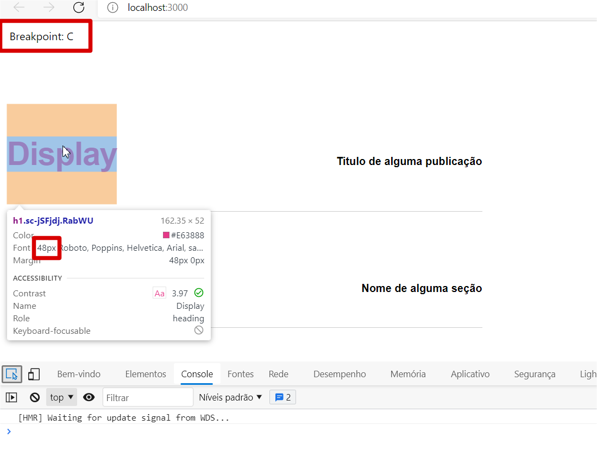

Tela Mobile - Breakpoint B
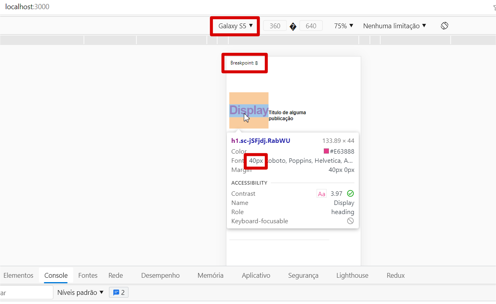

Tela Mobile - Breakpoint A
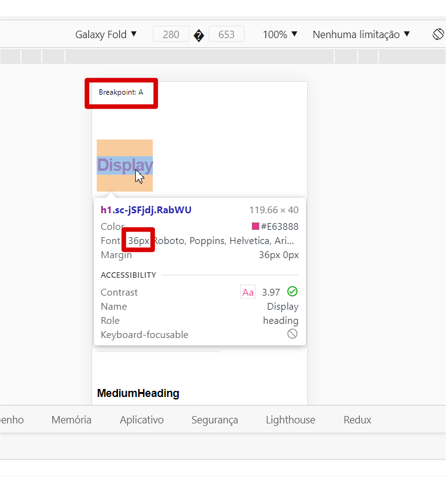

O arquivo onde fica o media query que consome a informação do array de breakpoints do tema, é o arquivo index.js que fica na pasta Breakpoint. Caso precise incluir um valor adicional no array para gerar um novo comportamento do tema via breakpoint, é necessário adicionar o media query neste arquivo também.

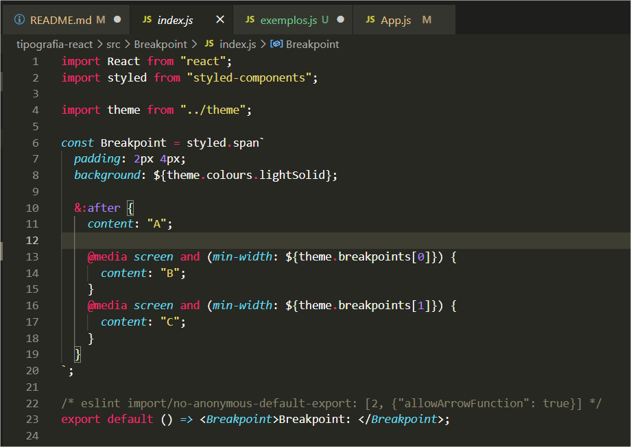

### 3.3 O Dynamic Component

O Dynamic Component é um High Order Component, criado usando o pacote [styled system](https://github.com/styled-system/styled-system), para definir quais são as props que podem ser alteradas, nos componentes do nosso tema.  
No arquivo index.js da pasta Dynamic Component é especificado todas as props que qualquer um dos nossos componentes do theme.js pode receber, e no arquivo index.js da pasta Typography, todos os componentes compartilham o Dynamic Component. 

Dynamic Component  
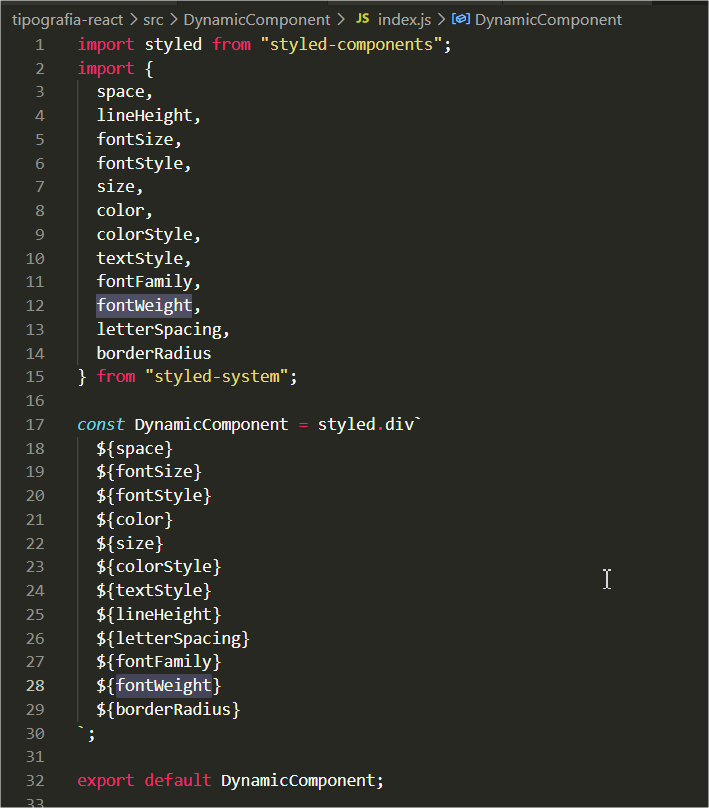

Typography  
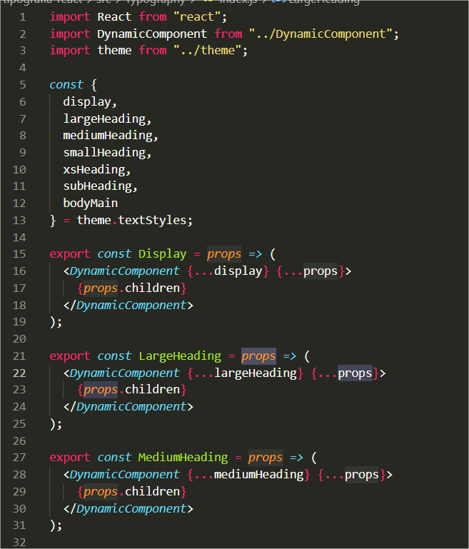

## 4. Usando os componentes

Para usar os componentes, basta apenas importa-los e chamar os componentes. Eles ja possuem suas props pré-definidas pelo theme.js, mas eles podem ser sobrescritos de acordo com a necessidade. São facilmente customizáveis.

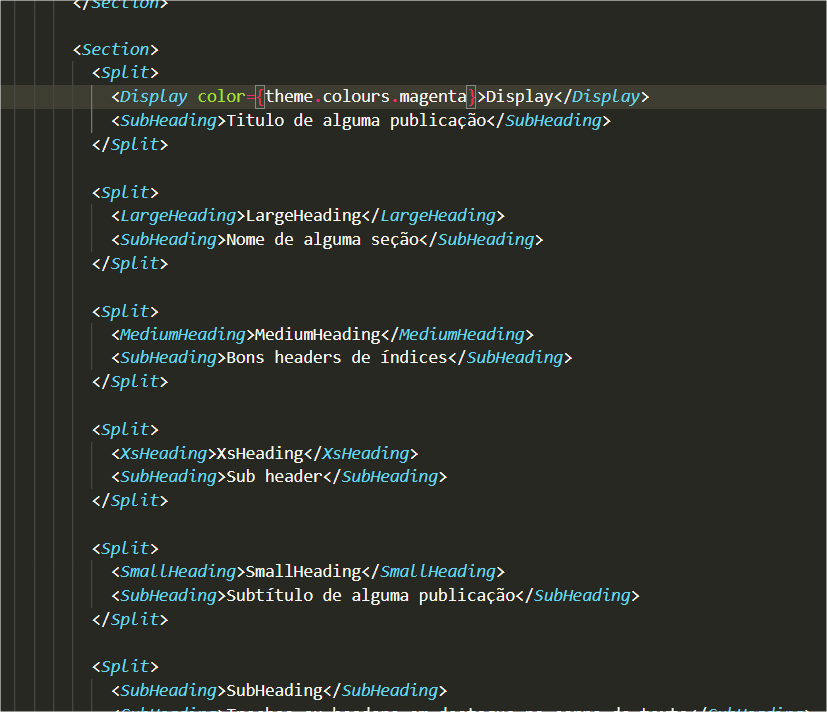

Os componentes permitem também que a marcação html dele seja sobrescrita. Por exemplo, não é obrigatório usar o Display sempre como h1, é possível usar ele como "
" ou "", passando a prop "as".

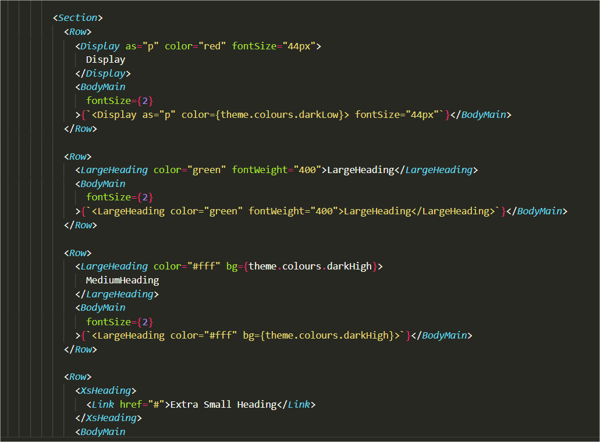

Para saber quais são todas as props que o componente aceita, basta conferir o arquivo index.js da pasta Dynamic Component. É também possível incluir facilmente uma nova propriedade a ser aceita, e isso será aplicado para todos os componentes do tema, facilitando a escalabilidade do projeto quando se deseja incluir novas props para serem aceitas pelos componentes. No entanto, esta Prop precisa fazer parte do pacote styled-system. 

### 4.1 Aninhando com componentes genéricos

Além de ter a estrutura padrão dos componentes do tema, também é possível criar novos componentes fora do tema, estilizando eles com styled components e carregando propriedades css exclusiva neles. Em seguida, junta-se estes componentes com os componentes da nossa tipografia. É o exemplo do componente criado chamado Link, assim como dos componentes presentes na pasta Layout. O componente Link por exemplo, possui a propriedade `text-decoration: underline`. Uma propriedade que não faz parte do nosso Dynamic Component.  
Esse componente então pode ser usado como um componente filho de algum dos componentes da nossa tipografia, fazendo com que essa propriedade seja aplicada, mesmo que ela não seja passada via props.

Componente Link  
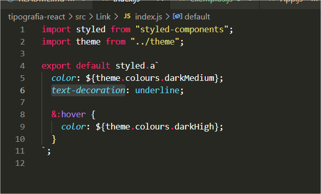

Link como Filho de XS Heading  
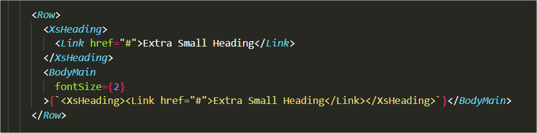

Xs Heading com text decoration  
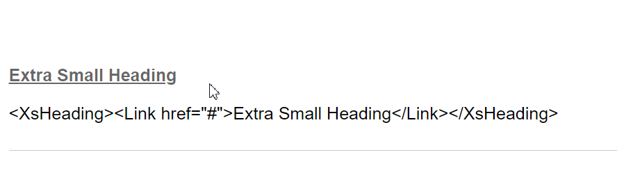

## 5. Criando novos componentes na Tipografia

Para criar novos componentes, é necessário apenas:
1. Adicionar o novo componente no arquivo theme.js, com as propriedades default desejadas.
2. Exportar esse componente no arquivo index.js, na pasta Typography, fazendo ele usar o Dynamic Component, passando todas as props com o operador spread. Neste mesmo arquivo, incluir ele junto com os outros componentes para receber os valores de theme.textStyles.

Com isso, o novo componente da tipografia ja pode ser importado para ser utilizado.
